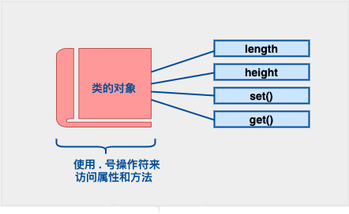

## C++ 类的定义和对象的初始化
定义一个类需要使用关键字 class，然后指定类的名称，并类的主体是包含在一对花括号中，主体包含类的成员变量和成员函数。

定义一个类，本质上是定义一个数据类型的蓝图，它定义了类的对象包括了什么，以及可以在这个对象上执行哪些操作。

对象的声明：
```angular2html
Box Box1;          // 声明 Box1，类型为 Box
Box Box2;          // 声明 Box2，类型为 Box
```
访问数据成员



我在写的时候clion编译器提示`Clang-Tidy: Uninitialized record type: 'box'`
Box box{};

查了一下资料：
If you don't provide an initialization list, the object is not initialized (since you have no default constructor), so the members have indeterminate values. Using the initialization list ensures that all the members are get a default initialization.

This warning alerts you to the fact that you may have uninitialized member variables.

在C++中，使用 Box Box1; 这样的语法进行变量声明通常不会产生错误。

这种写法会创建一个名为 Box1 的变量，其类型为 Box。如果 Box 是一个用户自定义的结构体或类，并且具有默认构造函数，那么 Box1 会使用默认构造函数进行初始化。如果 Box 没有默认构造函数，编译器将会报错，因为无法找到合适的构造函数来初始化 Box1。因此，在这种情况下，确保 Box 类型具有默认构造函数或显式提供初始化值是很重要的。

总的来说，Box Box1; 的语法通常没有问题。但是，需要注意确保 Box 类型具有默认构造函数或提供初始化值，以避免潜在的编译错误。